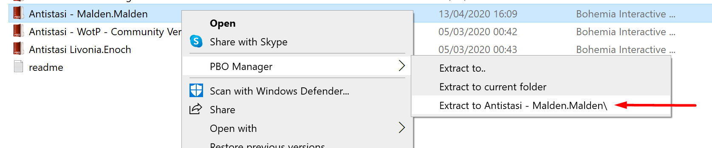

It all started when I wanted to see what takes to play Antistasi on another map not supported by the developers. This is a post with the steps required and all the pitfalls I encountered in the process. 

1. Install [PBOManager](http://www.armaholic.com/page.php?id=16369)
1. Go to `path where the game is installed\Arma 3\MPMissions` and extract the pbo mission(I'm using the Malden version but it doesn't really matter) 
1. Rename the extracted folder from `Antistasi - Malden.Malden` to `Antistasi - Malden.NewMapName`, in my case it was `Antistasi - Malden.Angel`. If you don't know how your map is named: go in the game, open the map in editor, save a scenario and look up the filename which was saved.
1. IMPORTANT. Move the folder from  `path where the game is installed\Arma 3\MPMissions` to `C:\Users\username\Documents\Arma 3\MPMissions`, otherwise the entities will not load up when trying to edit the scenario in eden
1. Open the game => host server => choose the new map => choose the green scenario and press the `3d editor` button. The other ways don't work, for example if trying to open the scenario straight from the editor if fails with a strange popup.
1. Everything else, like the owl meme :D

